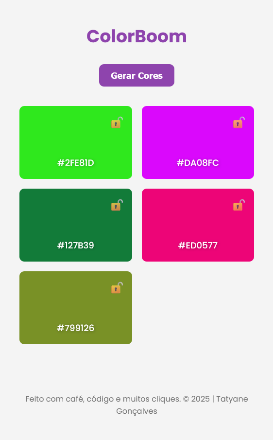

 # 🎨 ColorBoom - Gerador de Cores Aleatórias
Bem-vindo ao **ColorBoom**, um app web simples e funcional que gera paletas de cores aleatórias! Ideal para designers, devs ou qualquer pessoa que curte brincar com combinações de cores.

---

## ✨ Funcionalidades
- 🎲 Gera uma paleta com **5 cores aleatórias**
- 🔒 Permite **travar cores** específicas para mantê-las fixas
- 🟪 Mostra o código **HEX** de cada cor
- 📋 Permite **copiar** o código HEX com um clique
- 🔁 Geração de cores com **botão ou tecla de espaço**
- 📱 Layout 100% **responsivo**
- 🌗 Suporte a modo escuro

---

## 📸 Prévia
> Veja a calculadora funcionando clicando no link abaixo:

[🔗 Projeto em produção](https://tatyane-goncalves.github.io/random-colors-generator/)



---

## 🛠️ Tecnologias
- HTML5
- CSS3
- JavaScript 

---

## 📂 Estrutura do Projeto

```bash
  📁 random-colors-generator
  ├── 📁 src
  │ ├── 📁 styles
  │ │   └── style.css
  │ ├── 📁 scripts
  │ │   └── main.js
  │ └── 📁 screenshots
  │     ├── preview-desktop.png
  │     └── preview-mobile.png
  ├── index.html
  ├── README.md
  └── README-pt.md
```

---

## 🧪 Como Usar
1 - Clone o repositório:
```bash
git clone https://github.com/Tatyane-Goncalves/random-colors-generator.git
```

2 - Acesse a pasta do projeto:
```bash
cd random-colors-generator
```

3 - Abra o arquivo `index.html` no seu navegador.
4 - Clique no botão “Gerar cores” ou aperte a barra de espaço para criar uma nova paleta.
5 - Clique no código HEX para copiá-lo ou no cadeado para travar a cor.

---

## ✨ Funcionalidades Extras (futuras ideias)
- 💾 Salva paletas favoritas no LocalStorage

---

## 🎯 Objetivo

Este projeto foi feito como prática pessoal de Frontend e manipulação de DOM em JavaScript. A proposta simula uma demanda real de cliente para treinar desenvolvimento web na prática.

---

## 👩‍💻 Autor
Feito com 💜 por Tatyane Gonçalves