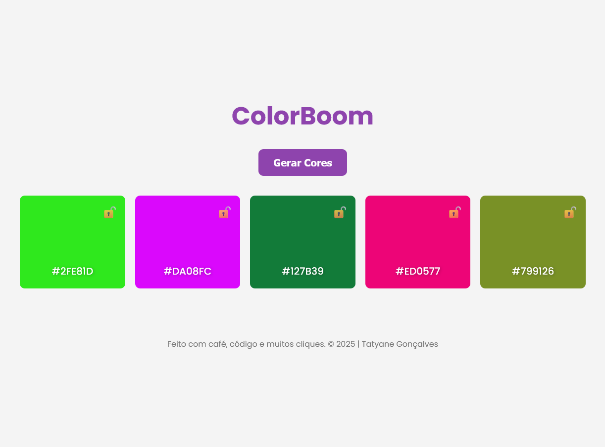
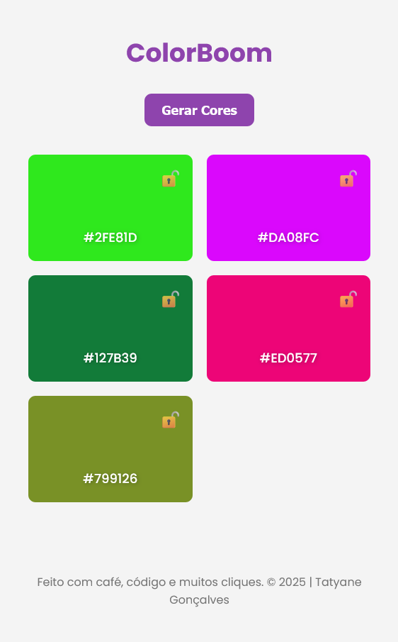

# 🎨 ColorBoom – Random Color Generator

Welcome to **ColorBoom**, a simple and functional web app that generates random color palettes! Perfect for designers, developers, or anyone who enjoys playing with color combinations.

---

## ✨ Features
- 🎲 Generates a palette with **5 random colors**
- 🔒 Allows you to **lock specific colors** to keep them fixed
- 🟪 Displays the **HEX code** of each color
- 📋 Lets you **copy** the HEX code with one click
- 🔁 Generate new colors with a **button click or spacebar**
- 📱 Fully **responsive** layout
- 🌗 Supports **dark mode**

---

## 📸 Preview
> Check out the app live at the link below:

[🔗 Live Demo](https://tatyane-goncalves.github.io/random-colors-generator/)



---

## 🛠️ Technologies Used
- HTML5  
- CSS3  
- JavaScript  

---


## 📂 Project Structure

```bash
  📁 random-colors-generator
  ├── 📁 src
  │ ├── 📁 styles
  │ │   └── style.css
  │ ├── 📁 scripts
  │ │   └── main.js
  │ └── 📁 screenshots
  │     ├── preview-desktop.png
  │     └── preview-mobile.png
  ├── index.html
  ├── README.md
  └── README-pt.md
```

---

## 🧪 How to Use

1 - Clone the repository:
```bash
git clone https://github.com/Tatyane-Goncalves/random-colors-generator.git
```

2 - Navigate to the project folder:
```bash
cd random-colors-generator
```

3 - Open the `index.html` file in your browser.
4 - Click the `Generate Colors` button or press the spacebar to generate a new palette.
5 - CClick on a HEX code to copy it, or click the lock icon to lock a color in place.


---
## ✨ Extra Features (future ideas)

- 💾 Save favorite palettes in LocalStorage

---

## 🎯 Purpose

This project was created as a personal practice in frontend development and DOM manipulation using JavaScript. The idea simulates a real client request to sharpen web development skills.

---

## 👩‍💻 Author
Made with 💜 by Tatyane Gonçalves
